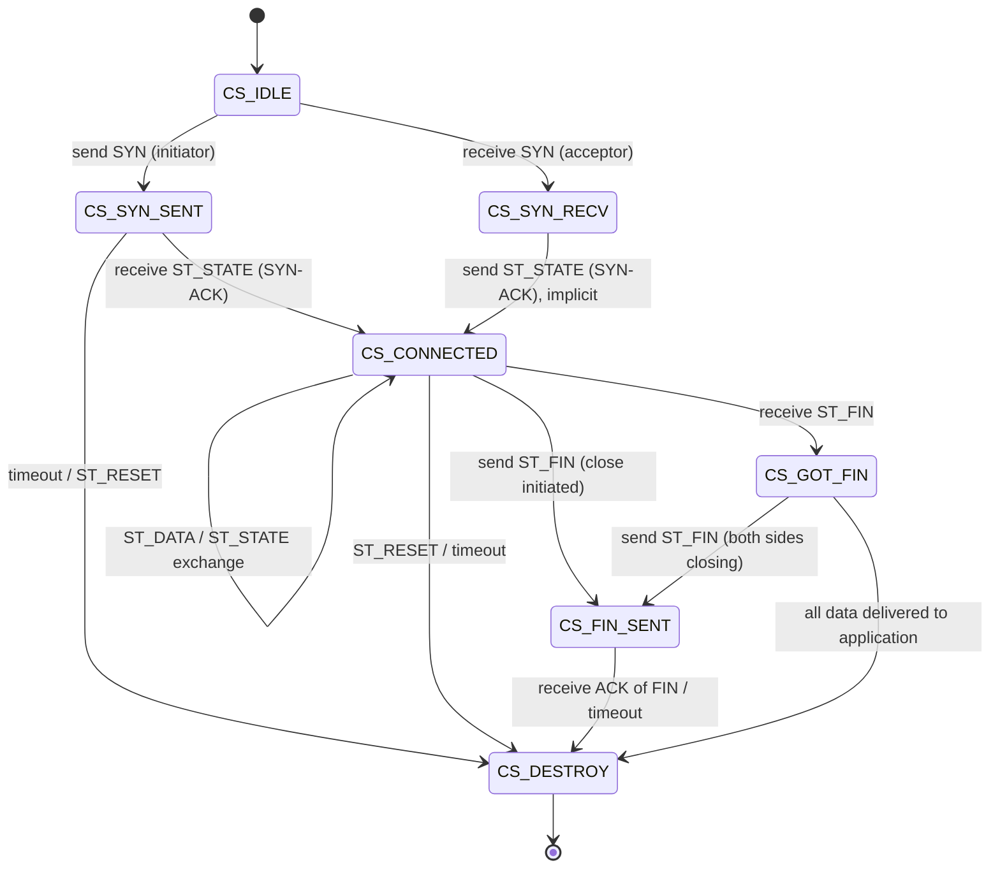

# BEP 29 — uTorrent Transport Protocol (uTP)

> Reference: <https://www.bittorrent.org/beps/bep_0029.html>

## Summary

uTP is a reliable, ordered, connection-oriented transport protocol built on top of UDP. It implements LEDBAT (Low Extra Delay Background Transport) congestion control, which targets ≤100 ms of extra queuing delay. This makes BitTorrent traffic automatically yield to interactive traffic (web browsing, gaming, VoIP) without requiring OS-level QoS configuration.

uTP matters because:

1. **ISP-friendly**: LEDBAT congestion control prevents BitTorrent from saturating the user's uplink, which historically caused bufferbloat and made the user's entire connection sluggish.
2. **NAT traversal potential**: Since uTP runs over UDP, it can share a single UDP port with DHT and potentially benefit from UDP hole punching (BEP 55).
3. **Industry standard**: Most production BitTorrent clients (libtorrent/qBittorrent, Transmission, µTorrent) use uTP as the default transport. Peers that only speak TCP miss connections with peers that prefer uTP.

This is the most complex BEP in Peer Pressure — it's essentially implementing a userspace TCP with custom congestion control on top of UDP.

## Protocol Specification

### Packet Header — 20 Bytes

Every uTP packet starts with a 20-byte header:

```
 0                   1                   2                   3
 0 1 2 3 4 5 6 7 8 9 0 1 2 3 4 5 6 7 8 9 0 1 2 3 4 5 6 7 8 9 0 1
+-+-+-+-+-+-+-+-+-+-+-+-+-+-+-+-+-+-+-+-+-+-+-+-+-+-+-+-+-+-+-+-+
| type  | ver=1 |  extension    |        connection_id          |
+-+-+-+-+-+-+-+-+-+-+-+-+-+-+-+-+-+-+-+-+-+-+-+-+-+-+-+-+-+-+-+-+
|                     timestamp_microseconds                    |
+-+-+-+-+-+-+-+-+-+-+-+-+-+-+-+-+-+-+-+-+-+-+-+-+-+-+-+-+-+-+-+-+
|                     timestamp_difference                      |
+-+-+-+-+-+-+-+-+-+-+-+-+-+-+-+-+-+-+-+-+-+-+-+-+-+-+-+-+-+-+-+-+
|                          wnd_size                             |
+-+-+-+-+-+-+-+-+-+-+-+-+-+-+-+-+-+-+-+-+-+-+-+-+-+-+-+-+-+-+-+-+
|           seq_nr              |           ack_nr              |
+-+-+-+-+-+-+-+-+-+-+-+-+-+-+-+-+-+-+-+-+-+-+-+-+-+-+-+-+-+-+-+-+
```

**Field breakdown (byte offsets):**

| Offset | Size | Field | Description |
|--------|------|-------|-------------|
| 0 | 1 | type + ver | High nibble: packet type (0–4). Low nibble: protocol version (always 1). |
| 1 | 1 | extension | ID of the first extension header (0 = no extensions). |
| 2 | 2 | connection_id | Identifies the connection. Big-endian uint16. |
| 4 | 4 | timestamp_microseconds | Sender's microsecond timestamp at send time. Big-endian uint32. Wraps every ~71 minutes. |
| 8 | 4 | timestamp_difference | Difference between the last received timestamp and the time we received it, in microseconds. Used for one-way delay estimation. |
| 12 | 4 | wnd_size | Sender's advertised receive window in bytes. Big-endian uint32. |
| 16 | 2 | seq_nr | Sender's sequence number for this packet. Big-endian uint16. |
| 18 | 2 | ack_nr | Last sequence number the sender has received from the remote side. Big-endian uint16. |

### Packet Types

| Value | Name | Description |
|-------|------|-------------|
| 0 | ST_DATA | Data packet. Payload follows the header (and any extensions). |
| 1 | ST_FIN | Connection close. No more data from sender. Has a seq_nr that must be ACKed. |
| 2 | ST_STATE | ACK-only packet (no payload, no seq_nr consumed). Used to acknowledge received data. |
| 3 | ST_RESET | Hard connection reset. Abort immediately. |
| 4 | ST_SYN | Connection initiation. Starts the three-way-ish handshake. |

### Extension Headers

If the `extension` field in the main header is non-zero, extension headers follow immediately after the 20-byte header. Each extension header has the format:

```
 0       1       2 ... 2+len-1
+-------+-------+-------------+
| next  |  len  |    data     |
+-------+-------+-------------+
```

- `next` (1 byte): Type of the next extension (0 = no more extensions).
- `len` (1 byte): Length of this extension's data in bytes.
- `data` (`len` bytes): Extension-specific data.

Extensions are chained: the main header's `extension` field names the first, and each extension's `next` field names the following one, until `next == 0`.

**Extension Type 1 — Selective ACK (SACK):**

The data field is a bitmask indicating which packets *after* `ack_nr` have been received. Each bit represents one sequence number:

- Bit 0 of byte 0 = `ack_nr + 2` (ack_nr + 1 is the one we're missing)
- Bit 1 of byte 0 = `ack_nr + 3`
- ...
- Bit 7 of byte 0 = `ack_nr + 9`
- Bit 0 of byte 1 = `ack_nr + 10`
- ...and so on.

The bitmask length is always a multiple of 4 bytes. A set bit means the packet at that sequence number has been received.

### Connection ID Assignment

- The **initiator** picks a random `connection_id` = R.
- The SYN packet is sent with `connection_id = R`.
- The initiator **receives** packets on `connection_id = R`, and **sends** data/state packets on `connection_id = R + 1`.
- The acceptor does the reverse: receives on `R + 1`, sends on `R`.

This asymmetry allows a single UDP socket to demultiplex multiple uTP connections.

### Connection State Machine



**States:**

| State | Description |
|-------|-------------|
| CS_IDLE | Initial state. No connection. |
| CS_SYN_SENT | SYN sent, waiting for SYN-ACK (ST_STATE). |
| CS_SYN_RECV | SYN received, SYN-ACK sent. Waiting for first data or state. |
| CS_CONNECTED | Connection established. Data flows in both directions. |
| CS_FIN_SENT | We sent FIN. Waiting for peer to ACK it. |
| CS_GOT_FIN | Received FIN from peer. Still delivering buffered data to app. |
| CS_DESTROY | Connection is being torn down. Resources will be freed. |

### Connection Handshake

1. **Initiator** sends `ST_SYN` with `seq_nr = 1`, `connection_id = R` (random).
2. **Acceptor** replies with `ST_STATE` (ACK of the SYN), `ack_nr = 1`, `connection_id = R + 1`.
3. **Initiator** transitions to `CS_CONNECTED` upon receiving the ST_STATE.
4. Data transfer begins. The initiator's first data packet has `seq_nr = 2`.

### Sequence Numbers and ACKs

- Sequence numbers are 16-bit unsigned integers that wrap around.
- `ST_DATA` and `ST_FIN` packets consume a sequence number (seq_nr is incremented).
- `ST_STATE` packets do NOT consume a sequence number (they are pure ACKs).
- `ack_nr` is the sequence number of the last packet we received *in order*.
- Out-of-order packets are tracked via the SACK extension.

### Congestion Control — LEDBAT

LEDBAT (RFC 6817) targets low extra delay. The algorithm:

1. **One-way delay measurement**: Each side includes its microsecond timestamp in every packet (`timestamp_microseconds`). The receiver computes `delay = local_receive_time - packet_timestamp` and sends it back as `timestamp_difference` in subsequent packets. This gives the sender an estimate of the one-way queuing delay.

2. **Base delay**: Maintain a rolling minimum of delay samples over the last ~2 minutes. This estimates the propagation delay (no queuing). `base_delay = min(delay samples over window)`.

3. **Queuing delay**: `queuing_delay = current_delay - base_delay`.

4. **Window adjustment**: On each ACK:

```
off_target = (TARGET - queuing_delay) / TARGET   // TARGET = 100ms = 100000µs
gain = MAX_CWND_INCREASE * off_target * bytes_acked / max_window
max_window = max(max_window + gain, MIN_WINDOW)
```

Where:
- `TARGET` = 100,000 µs (100 ms target delay)
- `MAX_CWND_INCREASE` = 3000 bytes (max window increase per RTT)
- `MIN_WINDOW` = 150 bytes (absolute minimum)

5. **On packet loss** (timeout or triple duplicate ACK): `max_window = max(max_window / 2, MIN_WINDOW)`.

### Retransmission

- **Packet timeout**: Starts at 1000 ms. On timeout, double it (exponential backoff). Minimum: 500 ms.
- **Timeout calculation**: `rto = max(rtt + 4 * rtt_var, 500ms)`. RTT and variance are computed using TCP-style EWMA:
  ```
  delta = rtt_sample - rtt
  rtt = rtt + delta / 8
  rtt_var = rtt_var + (abs(delta) - rtt_var) / 4
  ```
- **Triple duplicate ACK**: If three ST_STATE packets arrive with the same ack_nr, retransmit the packet at ack_nr + 1 immediately (fast retransmit).
- **Selective retransmission**: Use the SACK bitmask to identify exactly which packets are lost and retransmit only those.

### Window Management

- `wnd_size` is the advertised receive window — how many bytes the sender is willing to buffer.
- The effective sending window is `min(max_window, peer_wnd_size)`.
- When the peer's `wnd_size` is 0, the sender enters **zero-window probing**: send a single data byte periodically to check if the window has opened.
- The sender MUST NOT have more than `effective_window` bytes of unacknowledged data in flight.

### Connection Teardown

1. When the application calls `Close()`, send `ST_FIN` with the next seq_nr.
2. The FIN must be ACKed by the peer (like any data packet).
3. If both sides send FIN, both must ACK the other's FIN.
4. After receiving the ACK for our FIN (and delivering all buffered data), transition to `CS_DESTROY`.
5. On `ST_RESET`, immediately transition to `CS_DESTROY` — no further packets are processed.

## Implementation Plan

### Files to Create

| File | Purpose |
|------|---------|
| `utp/header.go` | Packet header encoding/decoding, extension parsing |
| `utp/conn.go` | Per-connection state machine, send/receive buffers, implements `net.Conn` |
| `utp/socket.go` | UDP socket multiplexer, dispatches packets to connections, implements `net.Listener` |
| `utp/congestion.go` | LEDBAT congestion control: delay tracking, window calculation |
| `utp/header_test.go` | Tests for header serialization round-trips |
| `utp/conn_test.go` | Tests for connection state machine, send/receive, retransmission |
| `utp/socket_test.go` | Tests for multiplexing, accept/dial |
| `utp/congestion_test.go` | Tests for LEDBAT window calculations |

### Key Types

```go
// utp/header.go

// PacketType identifies the uTP packet type.
type PacketType uint8

const (
    ST_DATA  PacketType = 0
    ST_FIN   PacketType = 1
    ST_STATE PacketType = 2
    ST_RESET PacketType = 3
    ST_SYN   PacketType = 4
)

const Version = 1
const HeaderSize = 20

// Header is the 20-byte uTP packet header.
type Header struct {
    Type        PacketType
    Extension   uint8
    ConnID      uint16
    Timestamp   uint32 // microseconds
    TimeDiff    uint32 // microseconds
    WndSize     uint32 // bytes
    SeqNr       uint16
    AckNr       uint16
}

// Extension is a parsed extension header.
type Extension struct {
    Type uint8
    Data []byte
}

// Packet is a fully parsed uTP packet.
type Packet struct {
    Header     Header
    Extensions []Extension
    Payload    []byte
}
```

```go
// utp/conn.go

// ConnState represents the connection state machine state.
type ConnState int

const (
    csIdle    ConnState = iota
    csSynSent
    csSynRecv
    csConnected
    csFinSent
    csGotFin
    csDestroy
)

// Conn is a uTP connection implementing net.Conn.
// It manages sequencing, acknowledgment, retransmission, and congestion control.
type Conn struct {
    mu           sync.Mutex
    state        ConnState
    recvID       uint16         // connection_id we receive on
    sendID       uint16         // connection_id we send on
    seqNr        uint16         // next sequence number to send
    ackNr        uint16         // last in-order seq_nr received from peer
    sendBuf      *sendBuffer    // unacked outgoing packets
    recvBuf      *recvBuffer    // reordering buffer for incoming data
    congestion   *ledbat        // congestion controller
    peerWnd      uint32         // peer's advertised window
    socket       *Socket        // parent socket for sending packets
    remoteAddr   *net.UDPAddr
    readReady    chan struct{}   // signals data available for Read
    writeReady   chan struct{}   // signals window available for Write
    closed       chan struct{}
    readDeadline  time.Time
    writeDeadline time.Time
}

// Read implements net.Conn. Blocks until data is available or deadline/close.
func (c *Conn) Read(b []byte) (int, error)

// Write implements net.Conn. Blocks until window is available or deadline/close.
func (c *Conn) Write(b []byte) (int, error)

// Close sends FIN and transitions to CS_FIN_SENT.
func (c *Conn) Close() error

// LocalAddr, RemoteAddr, SetDeadline, SetReadDeadline, SetWriteDeadline
// implement the rest of net.Conn.
```

```go
// utp/socket.go

// Socket multiplexes uTP connections over a single UDP socket.
type Socket struct {
    conn     *net.UDPConn
    conns    map[uint16]*Conn  // connID → active connection
    mu       sync.RWMutex
    incoming chan *Conn         // accepted connections
    closed   chan struct{}
}

// Listen creates a Socket bound to the given UDP address.
// The returned Socket implements net.Listener via Accept().
func Listen(network, address string) (*Socket, error)

// Accept waits for an incoming uTP connection (net.Listener interface).
func (s *Socket) Accept() (net.Conn, error)

// Dial initiates a uTP connection to the given address.
func (s *Socket) Dial(ctx context.Context, addr *net.UDPAddr) (*Conn, error)

// Close shuts down the socket and all connections.
func (s *Socket) Close() error

// Addr returns the socket's local address (net.Listener interface).
func (s *Socket) Addr() net.Addr
```

```go
// utp/congestion.go

// ledbat implements LEDBAT congestion control (RFC 6817).
type ledbat struct {
    maxWindow    int    // current congestion window in bytes
    baseDelay    uint32 // minimum observed one-way delay (µs)
    currentDelay uint32 // most recent delay sample (µs)
    rtt          int64  // smoothed RTT in µs
    rttVar       int64  // RTT variance in µs
    rto          int64  // retransmission timeout in µs
    delayHistory []delaySample // rolling window for base delay
    flightSize   int    // bytes currently in-flight (sent but unACKed)
}

type delaySample struct {
    delay     uint32
    timestamp time.Time
}

const (
    targetDelay     = 100_000 // 100 ms in µs
    maxCwndIncrease = 3000    // bytes per RTT
    minWindow       = 150     // bytes
    baseDelayWindow = 2 * time.Minute
    initialTimeout  = 1000_000 // 1s in µs
    minTimeout      = 500_000  // 500ms in µs
)

// OnAck updates the congestion window after receiving an ACK.
func (l *ledbat) OnAck(bytesAcked int, delay uint32, now time.Time)

// OnLoss halves the congestion window (packet loss detected).
func (l *ledbat) OnLoss()

// OnTimeout doubles the RTO and halves the window.
func (l *ledbat) OnTimeout()

// RTO returns the current retransmission timeout.
func (l *ledbat) RTO() time.Duration

// Window returns the current congestion window size in bytes.
func (l *ledbat) Window() int

// UpdateRTT updates RTT estimates from a new sample.
func (l *ledbat) UpdateRTT(sample time.Duration)
```

### Internal Buffer Types

```go
// utp/conn.go (unexported)

// sendBuffer tracks outgoing packets awaiting acknowledgment.
type sendBuffer struct {
    packets map[uint16]sentPacket // seq_nr → packet + metadata
    mu      sync.Mutex
}

type sentPacket struct {
    data     []byte    // raw packet bytes for retransmission
    sentAt   time.Time // for RTT calculation
    size     int       // payload size for congestion accounting
    retransmitted bool
}

// recvBuffer reorders incoming data packets and delivers them in sequence.
type recvBuffer struct {
    packets map[uint16][]byte // seq_nr → payload
    nextSeq uint16            // next expected sequence number
    mu      sync.Mutex
}
```

### Key Functions

```go
// utp/header.go

// Encode serializes a Header into 20 bytes.
func (h *Header) Encode() [HeaderSize]byte

// DecodeHeader parses a 20-byte header from raw bytes.
func DecodeHeader(data []byte) (Header, error)

// DecodePacket parses a full packet: header + extensions + payload.
func DecodePacket(data []byte) (*Packet, error)

// EncodePacket serializes a Packet into bytes for transmission.
func EncodePacket(p *Packet) []byte

// Microseconds returns the current time as a uint32 microsecond timestamp.
func Microseconds() uint32
```

```go
// utp/socket.go

// readLoop is the goroutine that reads UDP packets and dispatches to connections.
func (s *Socket) readLoop()

// dispatch routes a received packet to the appropriate Conn by connection_id,
// or creates a new Conn if it's a SYN for an unknown connID.
func (s *Socket) dispatch(pkt *Packet, addr *net.UDPAddr)

// sendPacket sends a raw packet through the underlying UDP socket.
func (s *Socket) sendPacket(pkt *Packet, addr *net.UDPAddr) error
```

```go
// utp/conn.go

// processPacket handles an incoming packet for this connection.
// Called by Socket.dispatch from the read loop goroutine.
func (c *Conn) processPacket(pkt *Packet)

// sendData fragments application data into packets respecting the congestion window.
func (c *Conn) sendData(data []byte) error

// ack sends an ST_STATE packet acknowledging the current ack_nr.
func (c *Conn) ack()

// retransmitLoop runs as a goroutine, checking for timed-out packets.
func (c *Conn) retransmitLoop()

// buildSACK constructs a selective ACK bitmask from the receive buffer's gaps.
func (c *Conn) buildSACK() []byte
```

### Package Placement

New package: `utp/`. This is a standalone transport layer — it does not import any other Peer Pressure packages. The `peer/` package will gain the ability to accept `net.Conn` from either TCP (`net.Dial`) or uTP (`utp.Socket.Dial`). Since `utp.Conn` implements `net.Conn`, the peer wire protocol works transparently over either transport.

### Integration with Peer Package

The `peer.Dial` function currently calls `net.DialTimeout("tcp", ...)`. To support uTP:

```go
// In peer/conn.go, add a DialUTP variant or make transport configurable:
func DialUTP(socket *utp.Socket, addr *net.UDPAddr, infoHash, peerID [20]byte) (*Conn, error) {
    utpConn, err := socket.Dial(context.Background(), addr)
    if err != nil {
        return nil, fmt.Errorf("utp connect: %w", err)
    }
    // From here, identical to TCP — doHandshake works on any net.Conn
    pc, err := doHandshake(utpConn, infoHash, peerID)
    if err != nil {
        utpConn.Close()
        return nil, err
    }
    return pc, nil
}
```

## Dependencies

| BEP | Relationship |
|-----|-------------|
| BEP 3 | Peer wire protocol — runs on top of uTP connections exactly like TCP |
| BEP 10 | Extension protocol — works transparently over uTP since it operates at the message layer |
| BEP 55 | Holepunch extension — uTP enables UDP hole punching for NAT traversal |
| RFC 6817 | LEDBAT congestion control — the algorithm uTP implements |

## Testing Strategy

### Unit Tests — Header (`utp/header_test.go`)

1. **`TestHeaderEncodeDecode`** — Encode a Header with known values, decode the result, verify all fields match.

2. **`TestHeaderTypeVersion`** — Verify type+version byte packing: `ST_SYN` with version 1 produces `0x41`, `ST_DATA` with version 1 produces `0x01`.

3. **`TestDecodePacketWithSACK`** — Build a packet with the SACK extension (type 1, 4 bytes of bitmask). Decode and verify the extension is parsed correctly.

4. **`TestDecodePacketNoExtensions`** — Packet with `extension = 0`. Verify empty extensions list, correct payload extraction.

5. **`TestDecodePacketChainedExtensions`** — Two extensions chained together. Verify both are parsed.

6. **`TestDecodeHeaderTooShort`** — Input shorter than 20 bytes returns an error.

7. **`TestMicroseconds`** — Verify `Microseconds()` returns a reasonable value (non-zero, doesn't panic).

### Unit Tests — Congestion (`utp/congestion_test.go`)

8. **`TestLEDBATWindowIncrease`** — Simulate ACKs with low delay (queuing_delay < target). Verify `maxWindow` increases.

9. **`TestLEDBATWindowDecrease`** — Simulate ACKs with high delay (queuing_delay > target). Verify `maxWindow` decreases.

10. **`TestLEDBATOnLoss`** — Call `OnLoss()`. Verify window halved but not below `minWindow`.

11. **`TestLEDBATOnTimeout`** — Call `OnTimeout()`. Verify RTO doubled and window halved.

12. **`TestLEDBATMinWindow`** — Repeatedly call `OnLoss()`. Verify window never drops below `minWindow` (150 bytes).

13. **`TestLEDBATBaseDelay`** — Feed delay samples, then a much lower sample. Verify `baseDelay` updates to the new minimum.

14. **`TestLEDBATBaseDelayExpiry`** — Feed old samples (>2 min ago) and a newer higher sample. Verify old samples are evicted and `baseDelay` uses the newer window.

15. **`TestRTTEstimation`** — Feed RTT samples. Verify `rtt` and `rttVar` converge to expected values using the EWMA formulas.

### Unit Tests — Connection (`utp/conn_test.go`)

16. **`TestConnHandshake`** — Create two connected UDP sockets (localhost). Dial from one Socket, Accept on the other. Verify both reach `csConnected`.

17. **`TestConnReadWrite`** — After handshake, write "hello" on one side, read on the other. Verify data matches.

18. **`TestConnLargeTransfer`** — Transfer 1 MB of random data. Verify SHA-256 matches on both sides.

19. **`TestConnBidirectional`** — Both sides write and read concurrently. Verify no data corruption.

20. **`TestConnFIN`** — One side calls Close(). Verify the other side's Read() returns `io.EOF` after draining buffered data.

21. **`TestConnReset`** — One side sends ST_RESET. Verify the other side gets an error on Read/Write.

22. **`TestConnRetransmission`** — Use a lossy UDP proxy (drop 30% of packets). Transfer data and verify it arrives intact.

23. **`TestConnZeroWindow`** — One side stops reading (window fills to 0). Verify the sender pauses and resumes when the window opens.

24. **`TestConnDeadline`** — Set a short read deadline. Verify Read returns a timeout error when no data arrives.

### Unit Tests — Socket (`utp/socket_test.go`)

25. **`TestSocketMultipleConns`** — Accept 3 concurrent connections on one Socket. Verify each gets its own Conn with distinct connection IDs.

26. **`TestSocketClose`** — Close the Socket. Verify all active connections get errors and Accept returns immediately.

27. **`TestSocketDialTimeout`** — Dial to an address where nobody is listening. Verify it returns an error within a reasonable timeout (not hanging forever).

### Integration Tests

28. **`TestPeerWireOverUTP`** — Full BitTorrent handshake + message exchange over uTP. Use `peer.doHandshake` with a uTP `Conn` instead of TCP. Verify message round-trip works identically.
